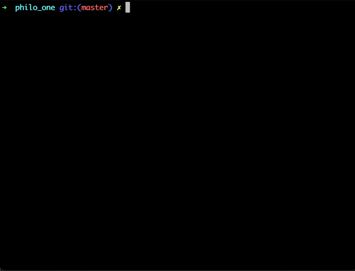

# :fork_and_knife: philosophers
A [42 school](https://www.42.fr/) project as a classic rendition of the [dining philosophers problem](https://en.wikipedia.org/wiki/Dining_philosophers_problem), a synchronization problem of threads competing for memory access. The goal is to avoid deadlocks using different methods.

<p align="center"></p>
<p align="center"><i>Fig.1 - Illustration of the dining philosophers problem, Wikipedia</i></p>  

## 🤔 The problem

Some philosophers (at least one) are gathered around a round table with a big bowl of spaghetti in the middle.    
- Philosophers are either **_eating_**, **_thinking_** or **_sleeping_** (what a cool life).  
When they eat, they can't think or sleep.   
When they think, they can't eat or sleep.   
And finally, when they sleep, they can't eat or think.   
- On the table, there is the same number of forks as the number of philosophers.
- Two forks are needed to eat spaghetti.
- Once a philosopher is done eating, he puts the forks down and start sleeping. Once awake, it starts thinking. The simulation ends when one philosopher starves.
- Each philosopher needs to eat and not starve.
- Philosophers don't communicate between themselves.
- Philosophers can't know if one of them is about to die.
    
For this project, we also have some additionnal specifications :
- `philo_one` must use a **_thread_** to represent a philosopher and a **_mutex_** to represent a fork
- `philo_two` must use a **_thread_** to represent a philosopher and a **_semaphore_** to represent a fork
- `philo_two` must use a **_process_** to represent a philosopher and a **_semaphore_** to represent a fork


## :spaghetti: Usage

```shell
# Compile one of the program
cd philo_one && make

# Run the program with the following arguments
./philo_one number_of_philosophers time_to_die time_to_eat time_to_sleep [number_of_times_each_philosopher_must_eat]
```
Where :    
- `number_of_philosophers` is a positive number of philosophers (and therefore forks).
- `time_to_die` is the time (in ms) a philosopher can survive after the start of its last meal.
- `time_to_eat` is the time (in ms) a philosopher takes to eat.
- `time_to_sleep` is the time (in ms) a philosopher takes to sleep.
- `number_of_time_each_philosopher_must_eat` is optional. When all the philosophers have eaten this number of times, the simulation ends. If not specified, the simulation ends when a philosopher dies.

### Output examples

<p align="center"></p>
<p align="center"><i>Fig.2 - Output example of `philo_one` with a configuration where no one should die</i></p>  
<br/>  
<p align="center"></p>
<p align="center"><i>Fig.2 - Output example of `philo_one` with a configuration where a philosopher should die</i></p>  

### Test cases

```
./philo 0 100 100 100   # exit with error
./philo 1 100 100 100   # exit with error
./philo 2 2 1 1         # ✅ should live
./philo 2 400 200 200   # ✅ should live
./philo 2 400 201 200   # ❌ should die
./philo 2 399 200 200   # ❌ should die
./philo 2 100 300 50    # ❌ should die
./philo 2 100 50 100    # ❌ should die
./philo 3 99 33 33      # ✅ should live
./philo 3 99 34 33      # ❌ should die
./philo 4 400 200 200   # ✅ should live
./philo 5 400 200 200   # ❌ should die
```

## 📖 Ressources  
Because multi-threading and multi-processes can be scary, here's some useful links to help you get started if you ever want to implement a similar project.
- [Jacob Sorber's guide on threads](https://www.youtube.com/watch?v=uA8X5zNOGw8&list=PL9IEJIKnBJjFZxuqyJ9JqVYmuFZHr7CFM&index=2) (YouTube video)
- [Jacob Sorber's tutorial on mutex and locks](https://www.youtube.com/watch?v=9axu8CUvOKY&list=PL9IEJIKnBJjFZxuqyJ9JqVYmuFZHr7CFM&index=4) (YouTube video)
- [Jacob Sorber's explanation of semaphores](https://www.youtube.com/watch?v=ukM_zzrIeXs&list=PL9IEJIKnBJjFZxuqyJ9JqVYmuFZHr7CFM&index=10) (that guy carried my project, thanks a lot) (YouTube video)
